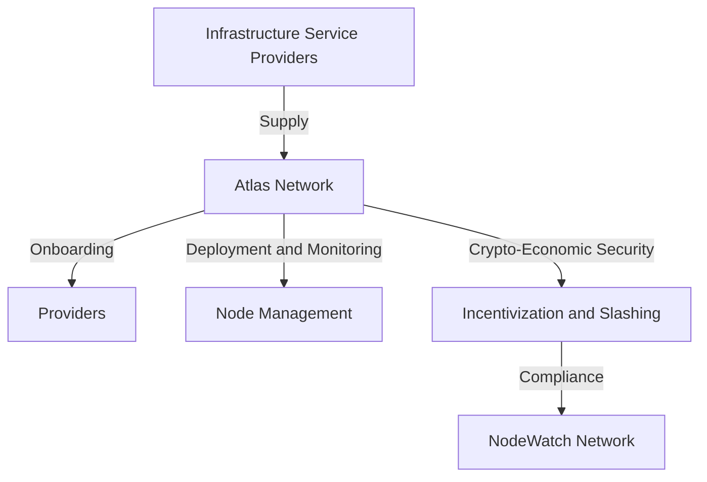

# Overview of Atlas Network

Atlas Network serves as the first unified marketplace for seamless node deployment on a decentralized and crypto-economically secured infrastructure. 

By deploying nodes via Atlas Network, protocols across multiple verticals can quickly and effectively solve for:

- Decentralization: ensuring a wide distribution of nodes to avoid central points of failure.
- Security and Reliability: providing a robust and secure node network.
- Ease of Use: Atlas Network massively simplifies the node deployment and management processes. It's so simple that protocols can easily incentivize solo node operators as Atlas Network abstracts away their technical overhead.

Atlas Network services include:

- Onboarding: integrating new providers into the network.
- Deployment and Monitoring: facilitating the deployment of nodes and constant monitoring for reliability and triage in the event of incidents.
- Incentivization and Slashing: ensuring that providers meet their Service Level Agreements (SLAs) through rewards and penalties, which are monitored and enforced via the NodeWatch Network.

As summarized in the following diagram:

## Atlas Network: node orchestrator

By providing these services, Atlas Network coordinates the activity of various DePINs (Decentralized Physical Infrastructure Networks). DePINs provide tangible, resources like compute power, storage, or even the physical devices that can support nodes, applications, or services. Atlas Network acts as the orchestration layer: coordinating and incentivizing the DePINs ensuring they work together seamlessly to serve your node-based infrastructure requirements. 

Atlas Network links everyone from protocols to solo stakers to reliable, instantly accessible decentralized physical infrastructure. Atlas Network runs as part of EigenLayer's Actively Validated Services (AVS) ecosystem. AVS are decentralized services that leverage restaked ETH to enhance security and efficiency by accessing Ethereum’s security infrastructure.

Atlas Network’s role is to simplify your node operations, allowing you to manage, deploy, and secure nodes across a decentralized ecosystem of infrastructure providers.

##  Explain it like I'm 5

Atlas Network is like a large, safe playground where parents (protocols or web3 projects) drop off their kids (nodes) to play. Parents provide pocket money (tokens) and each kid is allocated toys (infrastructure) by the store (infrastructure provider). Groups of kids converge together to build fantastic structures (decentralized node networks).

Helpful guardians (monitoring systems) watch to ensure everyone plays fairly, that the structures are safe, and that the toys don’t break. If something goes wrong, they quickly fix it, so everyone can keep playing.

The playground has several key features:

- New kids and toys are welcomed in (onboarding).
- The guardians make sure the environment is safe and the toys are ready to use (deployment and monitoring).
- Good players get rewards, and bad behavior can incur timeout penalties (incentivization and slashing).

## What next?

Interested in joining the Atlas Network? Learn more about becoming:

- A [node operator](https://docs.atlasnetwork.dev/docs/Node%20Operators)
- An [infrastructure provider](https://docs.atlasnetwork.dev/docs/Providers)
- A token holder
- A [restaking operator](https://docs.atlasnetwork.dev/docs/Restaking%20Operators)
- A [NodeWatcher](https://docs.atlasnetwork.dev/docs/NodeWatch%20Network)

Or [dive deeper](https://docs.atlasnetwork.dev/docs/Core%20Concepts) to understand the technology and tokenomics that ensure that Atlas Network facilitates a reliable decentralized node network. 
